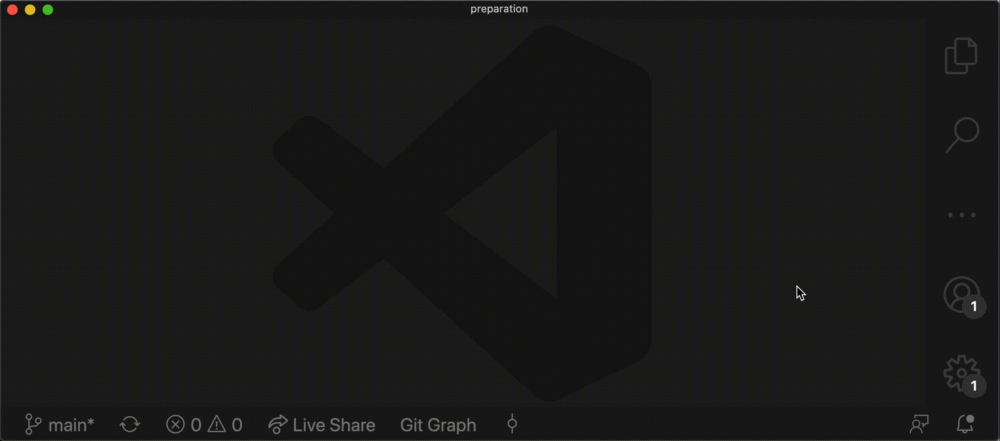
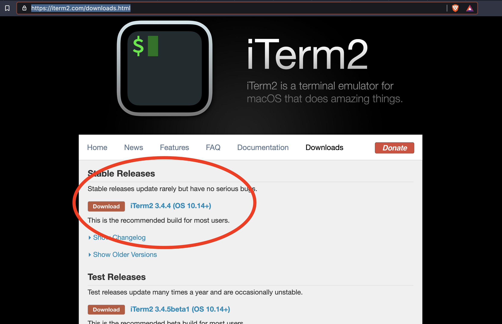
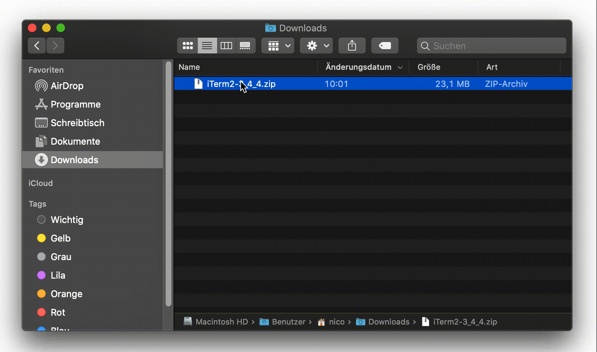

# Preparation Web Development Bootcamp

> 🍏 This preparation assumes that you are using a Mac(Book). For preparation details for Windows or Linux pleaes contact us.

You will install the following tools.

- Browser
- Zoom
- Visual Studio Code
- iTerm2
- Command Line Tools
- Homebrew
- Git
- NVM and Node.js

> 💡 Visual Studio Code is the most important tool we need on day one. If you have any problems with the other steps please don't panic - we can solve these together 👋

> 💡 During the installation of most toolings you will be asked to "close the terminal and open a new terminal". That is because during the setup of most toolings certain settings / configurations of your computer will be changed. These changed settings will not be active until you open a new terminal.

## Browser

Most developers out there use a Chrome-based browser to develop web applications. While Edge, Safari and all other browsers work well we will use a Chrome-based browser in this bootcamp.

You can either install [Google Chrome](https://www.google.com/chrome/) or (if you prefer privacy) you can install the [Brave Browser](https://brave.com/) (which is indeed a Chrome without any sniffing parts).

> Recommendation: Use the [Brave Browser](https://brave.com/) 🔥

## Zoom

We will use Zoom for all lectures and appointments.

1. Go to the [Zoom website](https://zoom.us/download) and download it
2. Visit your downloads folder and open the Zoom intaller
3. Follow the instructions of the Zoom installer

> 💡 If you already have Zoom installed on your machine please update it to the latest version.

### Zoom Account

> 💡 If you already have an zoom account you are done.

> 💡 If you don't have an zoom account please register a free account.

🚨 You can use your private email adresse **OR** you can use the `Sign In with Google` option and use your Coding Bootcamps Europe Google account.

## Visual Studio Code

You will write your first code ever and you will write a lot of it. That's why you need to install a proper code editor. We will use Visual Studio Code (or just VSCode) from Microsoft.

Go to the [website of Visual Studio Code](https://code.visualstudio.com/), download it and follow the instructions.

After you installed VSCode please complete the following steps below 👇

### Enable `"code"` shell command

We will use the terminal (or shell) a lot and it's convinient to open VSCode directly from the terminal. For that you need to install the code shell command.

1. Open Visual Studio Code
2. Press `CMD + SHIFT + P` and type `Install 'code' command in PATH`
3. Select the entry `Shell Command: Install 'code' command in PATH` (should be selected already) and press ENTER.
4. VSCode should display a notification once the shell command is installed.



### Install Extensions

Extensions will make VSCode even better and you 10x more productive.

1. Open VSCode
2. Press `CMD + SHIFT + X` to open the Extensions Panel
3. Search for the following extensions and install them

- Live Server ([see extensions details](https://marketplace.visualstudio.com/items?itemName=ritwickdey.LiveServer))
- Prettier ([see extensions details](https://marketplace.visualstudio.com/items?itemName=esbenp.prettier-vscode))

### Customize VSCode Config

You will know tweak the settings of your VSCode, i.e.

- Enable [emmet](https://www.emmet.io/) commands
- Use Prettier as the default formatter
- Enable auto-formatting on every save

1. Open VSCode
2. Press `CMD + Shift + P` and type "Open Settings JSON"
3. Select the entry "Preferences: Open Settings (JSON)" and press `ENTER`
4. Paste the following code into the curly braces (`{}`) of the `settings.json` file

```
  "emmet.triggerExpansionOnTab": true,
  "prettier.requireConfig": false,
  "editor.defaultFormatter": "esbenp.prettier-vscode",
  "editor.formatOnSave": true
```

5. Save and close the file

## iTerm2

The default terminal on Macs does it's job but you will spend a lot of time in your console. That's why you will install the `iTerm2` terminal.

1. Go to the [iTerm2 website](https://iterm2.com/downloads.html) and download the stable release of iTerm2.



2. iTerm2 will be downloaded as a zip archive. After unpacking (double clicking on the zip file) the archive you can move (drag and drop) the iTerm2 app into your Applications folder.



3. Open iTerm2 (the file name is `iTerm.app`)

> 💡 You can use [Spotlight](https://support.apple.com/en-gb/HT204014) to search and open iTerm2. Press `CMD + SPACE` and type `iTerm`, select iTerm in the search results and press `ENTER`.

### Terminal Commands

If you are new to using a terminal you can checkout this [YouTube video](https://www.youtube.com/watch?v=5XgBd6rjuDQ) which explains the basic terminal commands.

## Command Line Tools

The `Command Line Tools` are a collection of tools that allow programmers to compile programs, process files and do even more fancy things. In order to install and run other toolings from our preparation we need to install them.

1. Open a new terminal (like iTerm2)
2. Type the command `xcode-select --install` and press `ENTER`

> If you receive a message that the command line tools are already installed, you are done here and proceed with installing `Homebrew` 🍺

> IF you get the message `Xcode is not currently available from the Software Update server` you first need to update the software update catalog 🤨. Type `sudo softwareupdate --clear-catalog` into a terminal and press `ENTER`. After that process with the `xcode-select --install` command from bullet point 2.

> If the command line tools are **NOT** installed a dialog window will show up. The dialog asks if you would like to install the tools now - please press the "Install" button.

> 🚨 If this installation fails (sometimes the apple servers are busy) restart the installing of the command line tools with `xcode-select install` command from bullet point 2.

## Homebrew

Next you will install [Homebrew](https://brew.sh/) which is a package manager that helps you installing mostly developer related toolings.

1. Open a terminal and run the command `/bin/bash -c "$(curl -fsSL https://raw.githubusercontent.com/Homebrew/install/HEAD/install.sh)"`
2. Follow the instructions of the script
3. Run the command `code ~/.bash_profile` and wait for VSCode to open
4. Add a new line to the end of the file and insert the code snipped below (this necessary for the terminal to execute toolings installed with brew)

```sh
# Add Homebrew's executable directory to the front of the PATH
export PATH=/usr/local/bin:$PATH
```

5. Save the file (`CMD + S`) and close VSCode (`CMD + W`).
6. Quit the terminal and open a new terminal (because after a restart of the terminal the changes in `~/.bash_profile` will be loaded)
7. Type the command `brew doctor` which should then ouput `Your system is ready to brew` (or something like this).

Skål you successfully installed homebrew 🍻

## Git

Next you will install [git](https://git-scm.com/) which is a version control system that we will use to manage the software we code.

You will use `homebrew` to install `git` on your computer.

1. Open a new terminal
2. Type the command `brew install git`
3. After git is installed close the terminal and open a new terminal
4. In the new tab (or terminal) type the command `git --version`
5. The command you ouput the installed git version

Terrific you have installed git on your computer 💅

## NVM and Node.js

Last but not least you will now install NVM (node version manager) and Node.js. NVM is a convinient tool to manage and install Node.js on your computer. Node.js itself is a runtime that can run JavaScript code outside of browsers.

1. Open a new terminal and run the command `curl -o- https://raw.githubusercontent.com/nvm-sh/nvm/v0.37.2/install.sh | bash`
2. Close the terminal and open a new terminal
3. Type the command `nvm --version` and check that the version of nvm is printed in the terminal
4. You will now install the LTS version of node using the command `nvm install --lts`
5. Type the command `nvm use --lts` to use the LTS verison of node
6. Type the command `node --version` to check if node is correctly insalled.

Fantastic you installed nvm and Node.js on your computer 🤓
